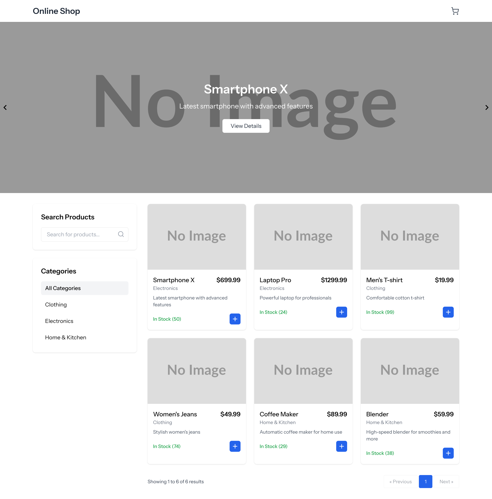
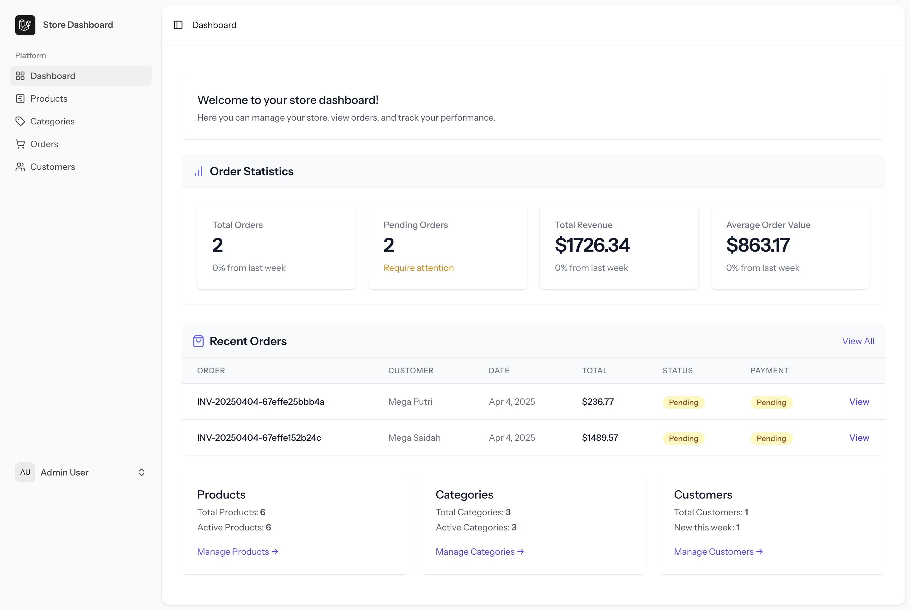
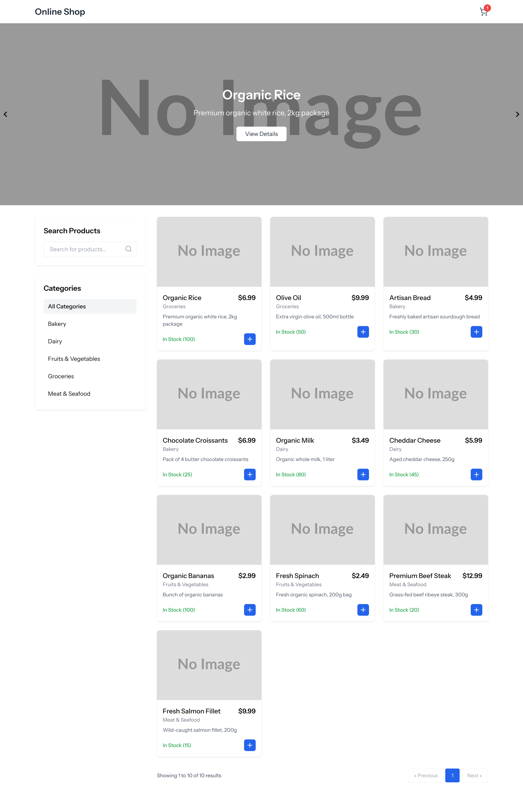
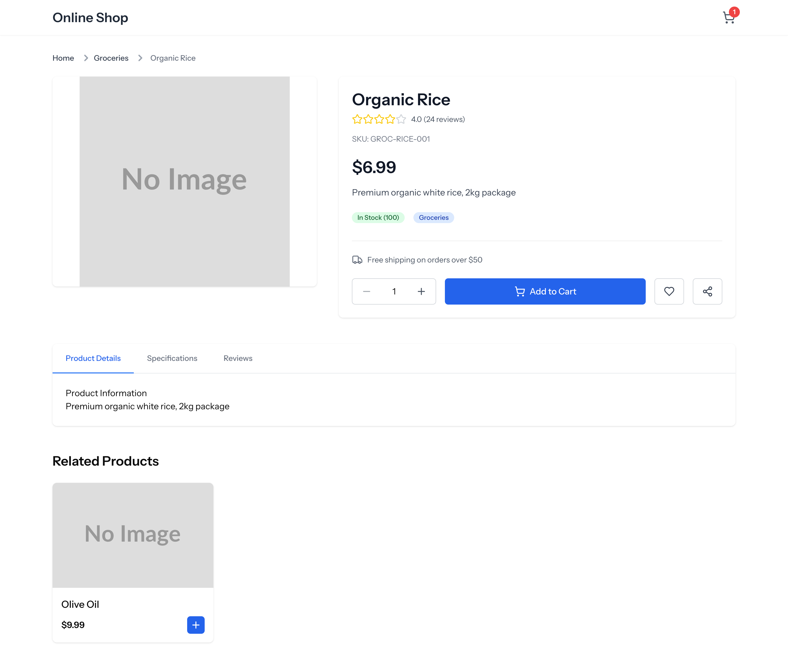
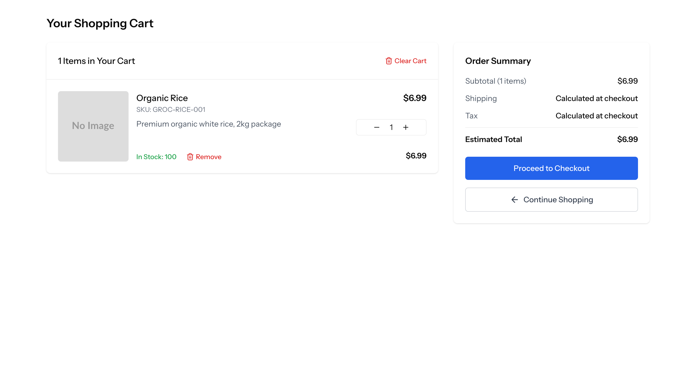
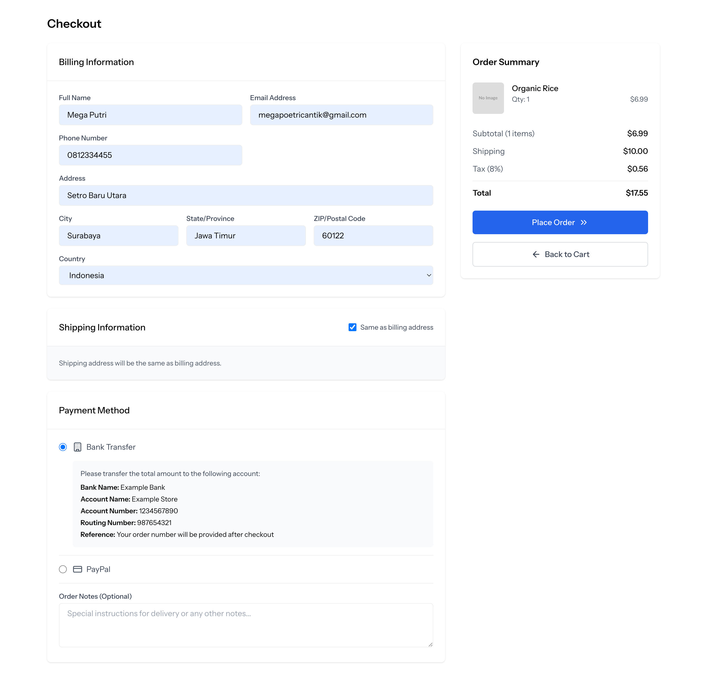
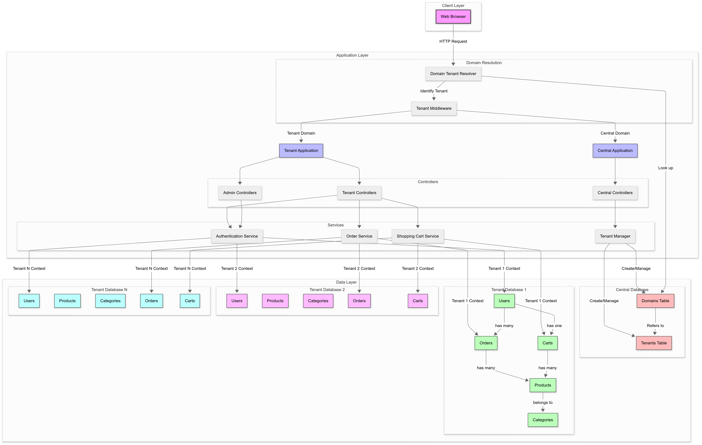
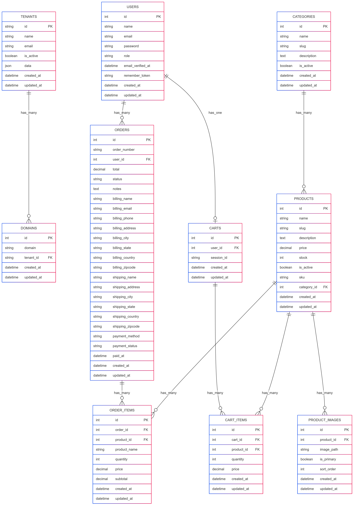
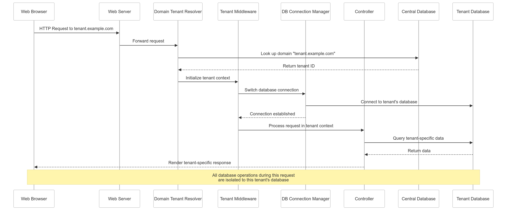

# Multi-Tenant eCommerce Platform Documentation

## Table of Contents
1. [Introduction](#introduction)
2. [Architecture Overview](#architecture-overview)
3. [Multi-Tenancy Implementation](#multi-tenancy-implementation)
4. [Database Structure](#database-structure)
5. [Authentication & Authorization](#authentication--authorization)
6. [Key Components](#key-components)
7. [Tenant Lifecycle](#tenant-lifecycle)
8. [Data Isolation](#data-isolation)
9. [Frontend Implementation](#frontend-implementation)
10. [Performance Considerations](#performance-considerations)
11. [Security Measures](#security-measures)
12. [Best Practices](#best-practices)

## Introduction

This multi-tenant eCommerce platform is built with Laravel and Vue.js, providing isolated storefronts for multiple merchants. Each tenant (store) has its own dedicated database for complete data isolation while sharing the same application codebase.

The platform uses:
- **Laravel** as the backend framework
- **Vue.js with Inertia.js** for the frontend
- **stancl/tenancy** package for multi-database tenancy
- **Multi-database architecture** for strict data isolation

## Screenshots

### Tenant 1
Focus on electronics and fashion products

URL: tenant1.localhost.com



Homepage


Admin - Dashboard


Admin - Product List


Admin - Order Detail

### Tenant 2
Focus on food and grocery products

URL: tenant2.localhost.com


Homepage


Product Detail


Shopping Cart



Checkout


Success Checkout


## Architecture Overview

### High-Level Architecture

The application follows a multi-database tenancy model where:

1. A central database stores tenant information and domain mappings
2. Each tenant has its own dedicated database containing store-specific data
3. The application dynamically connects to the appropriate tenant database based on the domain request



### Database Schema

- The central database with tenants and domains tables
- The tenant database schema showing all tables (users, products, categories, carts, orders, etc.)
- The relationships between entities with proper cardinality



## Tenant Request Flow 

- How the domain is resolved to identify the tenant
- The database connection switching process
- The complete flow from browser request to response
- How data isolation is maintained throughout the request




### System Components

- **Central Application**: Manages tenant registration, creation, and administration
- **Tenant Applications**: Individual store instances with isolated data and business logic
- **Tenant Resolver**: Identifies the correct tenant and connects to its database
- **Database Connection Manager**: Handles dynamic database switching

## Multi-Tenancy Implementation

### Technology Stack

The multi-tenancy implementation is based on the `stancl/tenancy` package, which provides:

- Domain-based tenant identification
- Dynamic database connection switching
- Tenant-aware routes and middleware
- Database creation and management tools

### Tenant Model

The `Tenant` model extends `BaseTenant` from the tenancy package and implements `TenantWithDatabase`:

```php
namespace App\Models;

use Illuminate\Database\Eloquent\Factories\HasFactory;
use Illuminate\Database\Eloquent\Model;
use Stancl\Tenancy\Database\Models\Tenant as BaseTenant;
use Stancl\Tenancy\Contracts\TenantWithDatabase;
use Stancl\Tenancy\Database\Concerns\HasDatabase;
use Stancl\Tenancy\Database\Concerns\HasDomains;

class Tenant extends BaseTenant implements TenantWithDatabase
{
    use HasFactory, HasDatabase, HasDomains;

    protected $fillable = [
        'id', 'name', 'email', 'is_active', 'data'
    ];

    public static function getCustomColumns(): array
    {
        return [
            'id',
            'name',
            'email',
            'is_active',
            'data',
        ];
    }
}
```

### Tenant Service Provider

The `TenancyServiceProvider` configures the tenancy system and registers tenant-specific bootstrappers:

```php
namespace App\Providers;

use Illuminate\Support\ServiceProvider;
use Stancl\Tenancy\Middleware\InitializeTenancyByDomain;
use Stancl\Tenancy\Middleware\PreventAccessFromCentralDomains;

class TenancyServiceProvider extends ServiceProvider
{
    public function register()
    {
        // Register tenant bootstrappers and other configurations
    }

    public function boot()
    {
        // Configure tenant routes and middleware
    }
}
```

## Database Structure

### Central Database

The central database contains:

- **tenants**: Stores tenant information (name, email, etc.)
- **domains**: Maps domains to tenants

Migration files:
- `2019_09_15_000010_create_tenants_table.php`
- `2019_09_15_000020_create_domains_table.php`

### Tenant Database

Each tenant has its own isolated database with the following tables:

- **users**: Store administrators and customers
- **categories**: Product categories
- **products**: Store merchandise 
- **product_images**: Images associated with products
- **carts**: Shopping carts for users or sessions
- **cart_items**: Items in shopping carts
- **orders**: Customer orders
- **order_items**: Items in orders
- **sessions**: User sessions

Tenant migrations are stored in the `database/migrations/tenant/` directory.

## Authentication & Authorization

### Multi-Database User Authentication

Authentication is tenant-specific, with each tenant having its own users table. The system:

1. Identifies the tenant based on the domain
2. Connects to the tenant's database
3. Authenticates against the tenant's users table

### User Roles

The User model includes a role field for authorization:

```php
public function isAdmin()
{
    return $this->role === 'admin';
}
```

## Key Components

### Controllers

The application includes various controller types:

1. **Central Controllers**: Manage the central application functionality
   - `HomeController`: Handles central domain routing and tenant listing

2. **Tenant Controllers**: Handle tenant-specific functionality 
   - `Tenant\HomepageController`: Tenant store homepage
   - `Tenant\ProductController`: Customer-facing product display
   - `Tenant\CartController`: Shopping cart functionality
   - `Tenant\OrderController`: Order processing

3. **Admin Controllers**: Manage tenant store administration
   - `Tenant\Manage\ProductController`: Product management
   - `Tenant\Manage\CategoryController`: Category management
   - `Tenant\Manage\OrderController`: Order management
   - `Tenant\Manage\CustomerController`: Customer management
   - `Tenant\Manage\StoreStatsController`: Store statistics

### Models

Key models include:

1. **Central Models**:
   - `Tenant`: Represents a tenant (store)

2. **Tenant Models**:
   - `User`: Store administrators and customers
   - `Category`: Product categories
   - `Product`: Store merchandise
   - `ProductImage`: Product images
   - `Cart`: Shopping carts
   - `CartItem`: Items in carts
   - `Order`: Customer orders
   - `OrderItem`: Items in orders

### Middleware

Custom middleware components:

- `TenantMiddleware`: Ensures proper tenant context
- `HandleAppearance`: Manages tenant-specific appearance settings
- `HandleInertiaRequests`: Configures Inertia.js for the current tenant

## Tenant Lifecycle

### Tenant Creation

Tenants can be created:
1. Manually through the admin interface
2. Programmatically using the `CreateTestTenants` command

The tenant creation process:
1. Creates a tenant record in the central database
2. Creates a domain record associated with the tenant
3. Creates a new database for the tenant
4. Runs migrations on the tenant database
5. Seeds initial data (optional)

### Database Initialization

When a new tenant database is created:
1. All migrations in `database/migrations/tenant/` are executed
2. The `TenantDatabaseSeeder` is run to populate initial data

### Commands

The application includes custom commands:
- `CreateTestTenants`: Creates test tenants for development
- `SeedExistingTenants`: Runs seeders on existing tenant databases

## Data Isolation

### Database-Level Isolation

Each tenant has a completely separate database, providing:
- Strong data isolation
- Independent scaling
- Compliance with data residency requirements
- No risk of data leakage between tenants

### Connection Management

Database connections are managed by:
1. Identifying the tenant through domain resolution
2. Dynamically switching the database connection
3. Maintaining connection separation throughout the request lifecycle

## Frontend Implementation

### Inertia.js Integration

The frontend uses:
- Vue.js components
- Inertia.js for server-client communication
- Tenant-specific page components

### Tenant-Specific UI

Tenant pages are located in `resources/js/pages/tenant/` and include:
- Homepage
- Product detail
- Shopping cart
- Checkout and payment
- Order confirmation

### Admin Interface

The admin interface allows tenant administrators to:
- Manage products and categories
- Process orders
- View customer information
- Access store statistics

## Performance Considerations

### Database Connection Pooling

For production environments, implement connection pooling to:
- Reduce database connection overhead
- Improve request handling capacity
- Optimize resource utilization

### Caching Strategies

Implement tenant-aware caching by:
- Namespacing cache keys with tenant identifiers
- Using database-specific cache stores when necessary
- Implementing cache invalidation strategies

## Security Measures

### Data Isolation Validation

Regularly validate tenant isolation by:
- Testing cross-tenant access attempts
- Verifying middleware is correctly applied
- Auditing database connection switching

### Input Validation

All controllers implement:
- Strict input validation
- SQL injection prevention
- CSRF protection

### User Authentication

Tenant user authentication includes:
- Secure password hashing
- Session management
- Role-based access control

## Best Practices

### Tenant-Aware Development

When developing for this multi-tenant architecture:

1. **Always be tenant-aware**:
   - Check if code will run in tenant context
   - Use tenant-specific paths and URIs

2. **Follow tenancy database conventions**:
   - Place tenant migrations in the tenant directory
   - Use the correct database connection

3. **Test with multiple tenants**:
   - Create test tenants with the provided commands
   - Verify functionality across tenant boundaries

4. **Optimize for scale**:
   - Consider connection limits as tenant count grows
   - Monitor database performance per tenant

### Extending the Platform

When adding new features:

1. Determine if the feature is tenant-specific or central
2. Place migrations in the appropriate directory
3. Update tenant initialization processes if necessary
4. Test with multiple tenants to verify isolation
